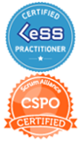

Welcome to the personal website of Florian Knorr. 
I am a German physicist working in the field of IT.

#### Trivia
* Since 07/2019 I am a Certified LeSS Practitioner.
* Since 08/2016 I am a Certified Scrum Product Owner (CSPO).
* Parts of my academic research were nominated for the Cleantech Media Award 2012. 
There is still a video (in German) which explains my approach to fighting traffic congestion:
Watch the video on [YouTube](https://www.youtube.com/watch?t=28&v=aRZy02tqaSw#t=2m38s) 
(starts at 2:38)
* My Erdős number: 5 (more about the [Erdős number on Wikipedia](https://en.wikipedia.org/wiki/Erd%C5%91s_number))

